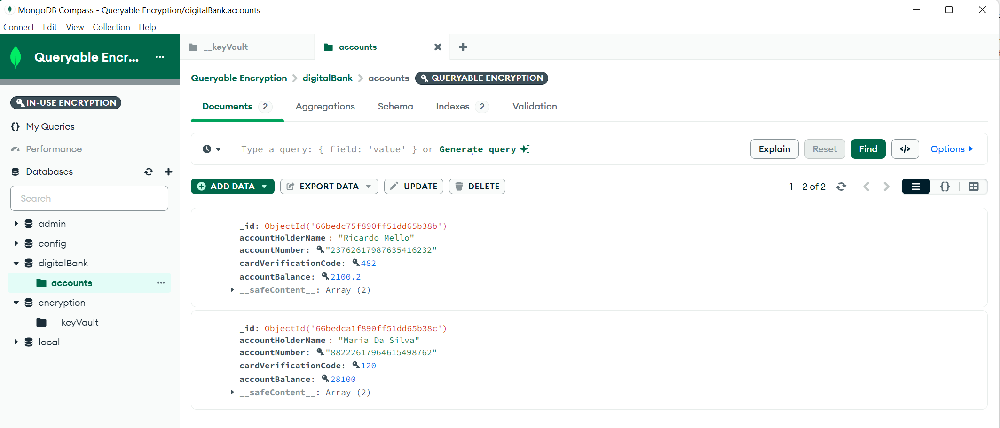

# BankAccount Service

The BankAccount service project aims to explore queryable encryption using MongoDB. By automatically encrypting and decrypting specific fields upon retrieval, we support advanced querying, including equality and range greater than (GT) operations.
## Prerequisites
- MongoDB 8.0 ReplicaSet
- Java 17+ 


## Insert One
To insert a new bank account, make a `POST` request to `http://localhost:8080/bank`. The body of the request should include the following fields:

- `accountHolderName` (required, string)
- `accountNumber` (required, string)
- `cardVerificationCode` (required, string)
- `accountBalance` (required, number)

### Example 

```
     curl --location 'http://localhost:8080/bank' \
        --header 'Content-Type: application/json' \
        --data '{
        "accountHolderName": "Ricas",
        "accountNumber": "9872334",
        "cardVerificationCode": "192",
        "accountBalance": 2100.2
}'
```

## Compass Encrypted data


## Find All
To retrieve all bank accounts, make a GET request to http://localhost:8080/bank.

## Find by Account Number
To find a bank account by its account number, make a GET request to http://localhost:8080/bank/{accountNumber}, replacing {accountNumber} with the actual account number of interest.


## Compass IN-USE Encryption



# Author
Ricardo Mello
- Ricardo on [MongoDB Developer Community](https://www.mongodb.com/community/forums/u/ricardo_silva_de_mello/summary).
- Ricardo on [GitHub](https://github.com/ricardohsmello)

